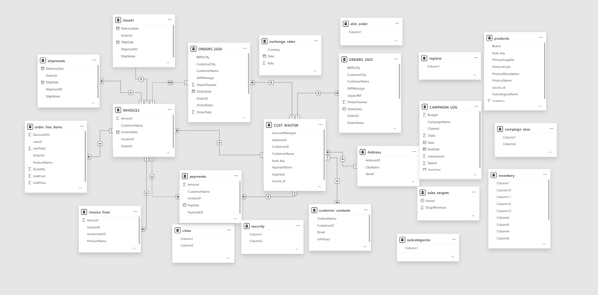
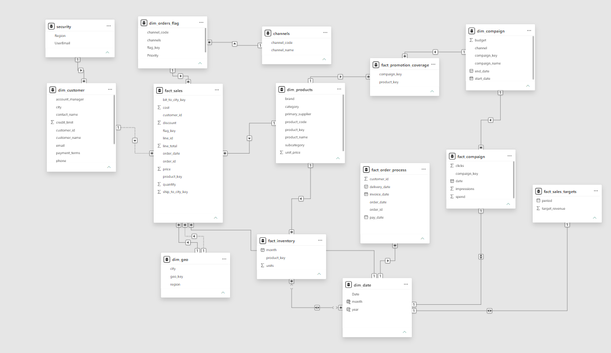

# From Chaos to Star Schema — A Power BI Data Modeling Project

End-to-end rebuild of a real-world "nightmare" dataset — 23+ disconnected, duplicated, and poorly structured tables — into a clean, business-ready star schema in Power BI.

Based on the *Nightmare Data Model* project by [Data With Baraa](https://www.datawithbaraa.com/).

---

## 📌 Why this project

Most Power BI projects don't fail because of the visuals — they fail because of the model underneath. Slow refreshes, slow reports, and (worst of all) wrong numbers almost always trace back to a weak data model, not a bad chart. This project was my hands-on exercise in fixing exactly that: taking a genuinely messy dataset — the kind you're likely to inherit on the job, not a sanitized tutorial file — and turning it into a model that is fast, trustworthy, and easy to extend.

---

## 🧭 Understanding the business first

Before touching any table, the first step was understanding the business itself: what the entities are, what counts as a **dimension** (the "who/what/where/when" — customers, products, geography, dates) versus a **fact** (the measurable business events — sales, orders, shipments, inventory movements).

A few business concepts clarified along the way:

- **Invoice vs. Receipt** — an invoice says *"you owe me money,"* a receipt says *"you paid me money."* They represent different points in the transaction lifecycle.
- **ShipToCity vs. BillToCity** — the delivery address and the billing address are not always the same customer location (e.g. billed in Rabat, shipped to an office in Casablanca), so both needed to be modeled distinctly.
- **Order lifecycle** — `Ordered → Shipped → In Transit → Delivered`, where *Shipped* means the seller handed off the package, and *Delivered* means the customer actually received it.
- **OrderChannel** — represents where the order originated (Online, Store, Phone, Mobile App, Marketplace). In the raw data this arrived as an integer code rather than text, which is a common enrichment problem to solve during modeling.

---

## 🔴 Before: the raw, unmodeled data

23+ tables with no consistent structure — duplicated customer tables, split fact-like tables (orders split by year, invoices split from invoice lines, payments disconnected from invoices), several tables with meaningless generic column names (`Column1`, `Column2`...), and no clear separation between dimensions and facts.

---

## 🟢 After: the clean star schema

A single source of truth: clearly separated dimension and fact tables, connected through surrogate keys, with consistent naming and correct relationship cardinality throughout.

---

## 🛠️ Building the dimensions

**dim_customer**
- Merged ~6 scattered customer-related tables into one.
- Removed unused columns and filtered out irrelevant rows.
- Grouped by customer ID to check for and resolve duplicates.

**dim_products**
- Merged 2 separate product tables into one.
- Created a surrogate key to uniquely identify each product.
- Standardized text casing across merged columns to avoid silent merge mismatches.

**dim_orders_flag** *(data enrichment)*
- Built a dedicated dimension out of descriptive attributes hiding inside the orders table (channel, status, priority) rather than leaving them as flat text columns in the fact table.

---

## 🧱 Building the fact tables

**fact_sales**
- Appended `orders_2025` and `orders_2026`, dropped columns that weren't common to both, and merged in the relevant dimension tables to build the base orders table.
- Merged in the dimensional keys and stripped out columns that don't belong in a fact table.
- **Golden rule applied:** a fact table should hold only measures (numbers to aggregate), foreign keys, and dates — nothing descriptive.

**A common relationship mistake — and the fix**

A recurring trap in this dataset (and in real projects generally — orders, invoices, shipments all show this pattern) was building a relationship directly between two fact-like tables instead of routing the relationship correctly through a shared dimension/key. Identifying and correcting this was one of the most important fixes in the whole rebuild, since it's the kind of mistake that silently produces wrong totals.

**Factless fact table**

Some business events don't have a natural numeric measure attached to them — they simply record that an event occurred (e.g. an order reaching a status, or a promotion being linked to a product). These were modeled as **factless fact tables**, which exist purely to record relationships/events rather than to store measures.

**fact_order_process** — a dedicated fact table tracking order fulfillment milestones (order date, delivery date, invoice date, payment date), separate from `fact_sales`, since it operates at a different grain than a sales line item.

---

## 🔐 Row-Level Security (RLS)

Applied at the model level (Model view → Manage Roles), restricting data access by region/user so that different business users only see the rows relevant to them.

---

## 🌟 Final model overview

| Dimension | Fact tables |
|---|---|
| dim_customer | fact_sales |
| dim_products | fact_order_process |
| dim_date | fact_inventory |
| dim_geo | fact_campaign |
| dim_campaign | fact_promotion_coverage |
| dim_orders_flag | fact_sales_targets |
| channels | |
| security | |

The result is a **galaxy schema** (multiple star schemas sharing conformed dimensions like `dim_date`, `dim_customer`, and `dim_geo`) rather than a single isolated star, since the business has several distinct processes (sales, order fulfillment, campaigns, inventory) that need to be analyzed both independently and together.

---

## 🧠 Key takeaways

- A clean model is what makes DAX simple — most "DAX problems" are actually modeling problems in disguise.
- Fact tables should be lean: keys, dates, and measures only. Descriptive attributes belong in dimensions.
- Not every fact table needs a numeric measure — factless facts are a legitimate and common pattern.
- Relationships must be built through the correct keys/dimensions, never directly fact-to-fact.
- Data modeling isn't a "nice to have" step — it's the difference between a report that's trusted and one that quietly gives wrong numbers.

---

## 🧰 Tools used

- Power BI Desktop
- Power Query (data cleaning, merging, enrichment)
- Data modeling view (relationships, RLS)

---

## 🙏 Credit

Project structure and dataset based on the free *Nightmare Data Model* course by [Data With Baraa](https://www.datawithbaraa.com/).