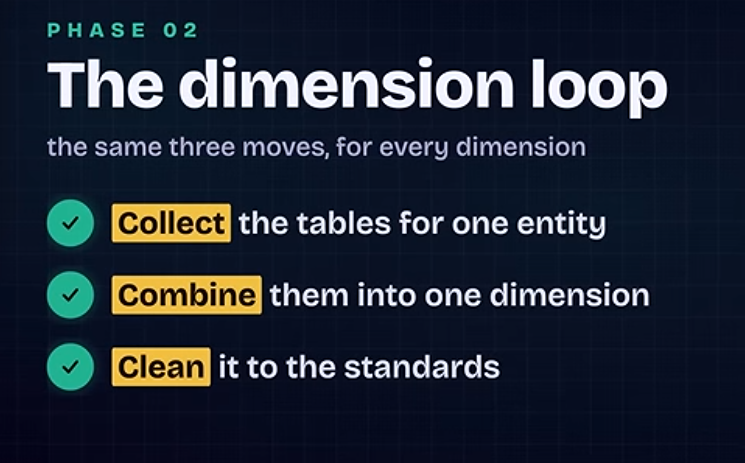
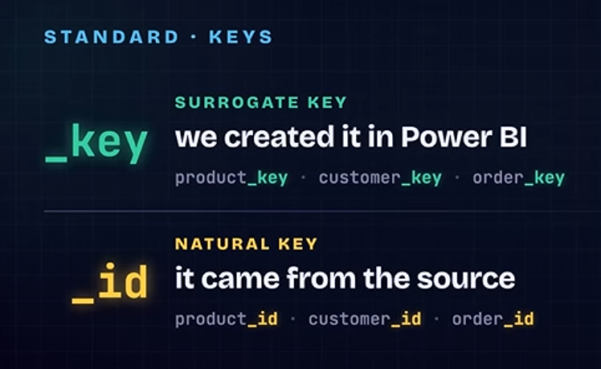
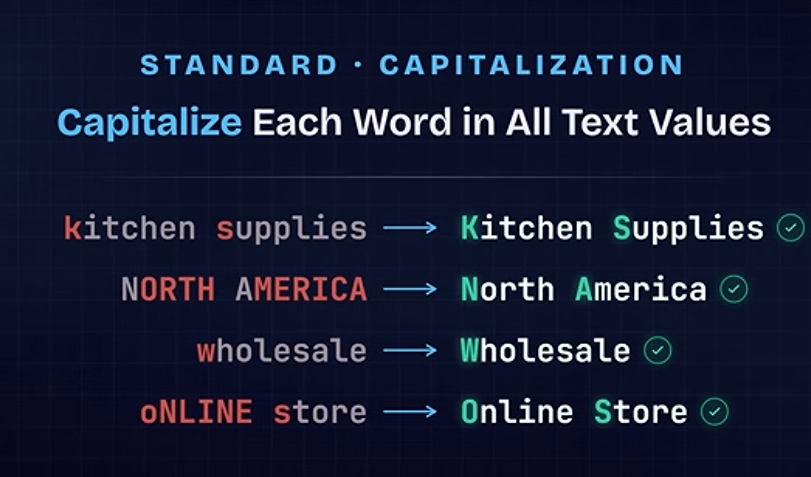

# Understand & Explore the data
get a feel for the data, not every detail:
- What is the business?
- what are the entities?
- what are dimentions?
- what are facts?
----------------------------------------------------------
in a data model, an invoice is basically a business transaction representing a bill/sale that needs to be paid.

Invoice vs. receipt

A simple way to remember:

Invoice → “You owe me money.”
Receipt → “You paid me money.”
---------------------------------------------------------

🚚 ShipToCity

ShipToCity = the city where the products should be delivered.

Example:

Customer orders a laptop and asks for it to be delivered to Casablanca.

Then:

ShipToCity = Casablanca

🧾 BillToCity

BillToCity = the city associated with the billing address.

This is the address used for the invoice/payment.

Example:

The customer lives in Rabat, but asks the laptop to be delivered to their office in Casablanca.

Then:
| Field          | Value      |
| -------------- | ---------- |
| **BillToCity** | Rabat      |
| **ShipToCity** | Casablanca |

Think of it as the **journey of the package** 📦:

**Order placed → Shipped → In transit → Delivered**

### 🚚 Shipped

When an order is **shipped**, it means the seller has **sent the package out**.

For example:

> You order a laptop from an online store on September 1.
> The store prepares the package and gives it to the delivery company on September 2.

At this point:

**Order status = Shipped**

The package is **on its way**, but the customer hasn't received it yet.

### 🏠 Delivered

When an order is **delivered**, it means the package has **arrived at the customer's delivery address**.

For example:

> The delivery company brings the laptop to your house on September 4.

Now:

**Order status = Delivered**

### Simple example

| Date   | Event                     | Status           |
| ------ | ------------------------- | ---------------- |
| Sept 1 | Customer places order     | Ordered          |
| Sept 2 | Seller sends package      | **Shipped** 🚚   |
| Sept 3 | Package is traveling      | In Transit       |
| Sept 4 | Customer receives package | **Delivered** 🏠 |

So remember:

> **Shipped = the seller sent it.**
> **Delivered = the customer received it.**

----------------------------------------------------------------

**OrderChannel** means **the channel through which the customer placed the order**.

In other words: **“Where did the order come from?”**

For example, a company might sell through several channels:

| OrderChannel    | Meaning                                        |
| --------------- | ---------------------------------------------- |
| **Online**      | Customer ordered through the website 💻        |
| **Store**       | Customer ordered/bought in a physical store 🏪 |
| **Phone**       | Customer placed the order by phone 📞          |
| **Mobile App**  | Customer ordered through the app 📱            |
| **Marketplace** | Customer ordered through another platform      |

This is useful for business analysis because you can compare **sales performance by channel**.
yes — if OrderChannel is an integer in your dataset, that's completely normal.

It probably means the dataset is using numeric codes to represent the different order channels rather than storing the text directly.

# Building Dimentions

## dim_customer:

- Merge around 6 table into one table.
- delete unuseful columns.
- filter rows
- groub by id to ckecks if there is any duplicates.

## dim_products
- merge 2 table into one.
- create a surrogate key.
- capitlize a column so that we have identical columns while merging and getting no errors.

